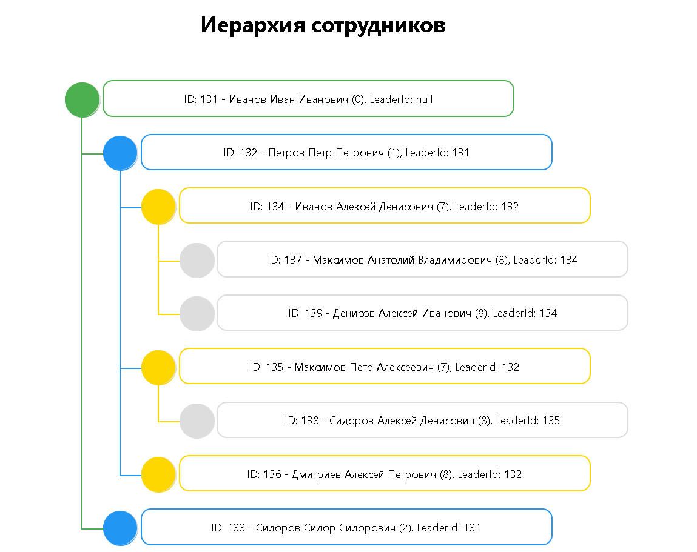

# CompanyApp

## Описание

Необходимо создать веб-приложение для управления списком сотрудников компании. Приложение должно содержать HTTP API для работы с базой сотрудников и предоставлять стартовую HTML-страницу, на которой отображается иерархия сотрудников. Данные сотрудников должны храниться в реляционной базе данных, поддерживаемой через EF Core.


## Использованные технологии

- **Asp.Net Core API**
- **React**
- **Docfx** для генерации документации
- **docker-compose** для контейнеризации приложения
- **Serilog** для логирования
- **SQLite** для локальной БД
- **XUnit** для тестирования DBStore и Controller
---

## Пример страницы


## Запуск через ASP.Net core API + React

### Установка подключения клиента к API
В файле `company-app-client/src/config.js` установите значение `DefaultApiUrl`:
```javascript
DefaultApiUrl = "http://localhost:5001/api";
```

### Запуск клиента
В терминале выполните:
```powershell
cd company-app-client
npm install
npm start
```

### Запуск API
Запустите API из Visual Studio.

- **Сайт:** [http://localhost:3000](http://localhost:3000)
- **Внешний адрес API:** [http://localhost:5001/api](http://localhost:5001/api)

### Инициализация тестовыми данными
Для инициализации тестовых данных выполните следующую команду в PowerShell:
```powershell
$response = Invoke-RestMethod -Uri "http://localhost:5001/api/employees/settestdata?count=50" -Method Get
$response
```
или ввести в браузере:
[http://localhost:5001/api/employees/settestdata?count=50](http://localhost:5001/api/employees/settestdata?count=50)
или воспользоваться swagger 
[http://localhost:5001/swagger/index.html](http://localhost:5001/swagger/index.html)
---
## Запуск через Docker Compose

### Установка подключения клиента к API
В файле `company-app-client/src/config.js` установите значение `DefaultApiUrl`:
```javascript
DefaultApiUrl = "http://localhost:8080/api";
```

### Запуск через Docker Compose
Запустите `docker-compose` из Visual Studio.

- **Сайт:** [http://localhost:8080](http://localhost:8080)
- **Внешний адрес API:** [http://localhost:5002/api](http://localhost:5002/api)

### Инициализация тестовыми данными
Для инициализации тестовых данных выполните следующую команду в PowerShell:
```powershell
$response = Invoke-RestMethod -Uri "http://localhost:5002/api/employees/settestdata?count=50" -Method Get
$response
```
или ввести в браузере:
[http://localhost:5002/api/employees/settestdata?count=50](http://localhost:5002/api/employees/settestdata?count=50)
---

## Тестирование
Проект включает в себя модульные тесты для EmployeesDBStore и EmployeesController. Чтобы запустить тесты запустите их в обозревателе тестов (Test Explorer) или выполните тесты локально с помощью следующей команды:
 ```bash
  dotnet test
 ```
[](https://github.com/German322VDK/CompanyApp/actions/workflows/test.yml)

---

## Документация
Чтобы ознакомится с документацией перейдите по [ссылке](https://german322vdk.github.io/CompanyApp/api/index.html)
